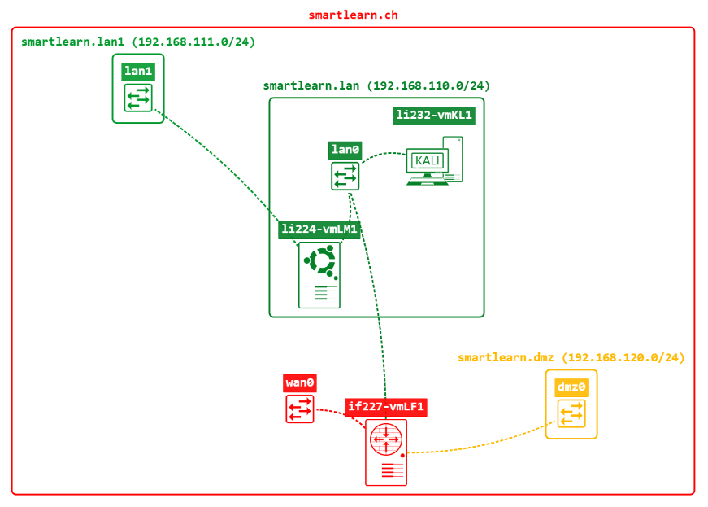

sudosyko/k8s_awx
# SA II Project: awx & code-server on Kubernetes Cluster 

## About this Project 

This is the project documentation for the System Administration II course at TSBE. 
This Project covers installing and scaling awx & code-server on Kubernetes. 

The goal is to install and build a Kubernetes cluster with the following requirements in place:
* scalability through the orchestration with Kubernetes
* containers with persistant storage i.E. a Database
* working container networking with portforwarding for external access
* secure configuration to minimize security risk

The repository also includes the ressources used for this project

## What is awx?

AWX is an open-source automation platform that provides a web-based user interface, REST API, and task engine built on top of Ansible.\
Developed by Red Hat, AWX serves as the upstream project for the Ansible Automation Plattform, offering a flexible and scalable solution for managing automation tasks and workflows.

[ansible/awx](https://github.com/ansible/awx)


## What is code-server?

Code-server is an open-source platform that allows developers to run Visual Studio Code (VS Code) in a remote server environment, accessed through a web browser.\
Code-server containers extend this concept further by encapsulating the code-server application and its dependencies within a containerized environment.

[coder/code-server](https://github.com/coder/code-server)

## Platform & Limitations

The following virtual plattform is hosted by the school to execute the project:



### vmKL1
The **vmKL1** is the management machine used to setup, administer and access the kubernetes cluster.

The VM Specs are:
* OS: Kali GNU/Linux Rolling (Graphical)
* Kernel: Linux 6.5.0-kali3-amd64
* CPU: 2 vCPUs
* RAM: 16 GB
* Storage: /dev/sda 35 GB 
* Network: Access to vmLM1 & Internet
* IP: 192.168.110.70

Installed Software:

* vscode
* vim
* tmux
* ansible

### vmLM11
The **vmLM11** is the Kubernetes host itself. It will act as Control Plane (Master Node) & Data Plane (Worker Node), as this is the only server provided for the project.

The VM Specs are:
* OS: Ubuntu 22.04.2 LTS
* Kernel: Linux 
* CPU: 4 vCPUs
* RAM: 12 GB
* Storage: /dev/sda 16 GB
* Network: Access to vmKL1 & Internet
* IP: 192.168.110.60


## Setup Guide

### Pre-Requisites vmlKL1:

```bash
# Update the System
sudo apt update -y && apt upgrade -y

# Install the following packages:
sudo apt install -y tmux vim snapd

# Enable & start the snap store
sudo systemctl enable snapd
sudo systemctl start snapd

# Install vscode with snap store
sudo snap install --classic code 
```

### Install Ansible on vmKL1 & setup ansible management access to vmLM1
This step isn´t mandatory, however it can be useful to have ansible installed on the management machine due to all the utilities that are shiped with it.

```bash
sudo apt install software-properties-common
sudo apt-get -y install ansible
```

Applications installed with the snap store aren´t stored in /usr/bin therefore they are only available over the full path (/snap/bin/code)
>Fix this with the following command:
```bash
sudo ln -s /snap/bin/code /usr/bin/code
```

### Pre-Requisites vmLM1:

```bash
# Enable & open necessary ports on server firewall
sudo ufw allow 22/tcp
sudo ufw allow 443/tcp
sudo ufw allow 8443/tcp
sudo ufw allow 10443/tcp
sudo ufw enable

# Enable ssh access by uncommenting the following line in /etc/ssh/sshd_config
Port 22

# restart sshd
sudo systemctl restart sshd

# Update the System
sudo apt update -y && apt upgrade -y
```

### Install & initialy setup Kubernetes on vmLM1

```bash

```

```bash

```
